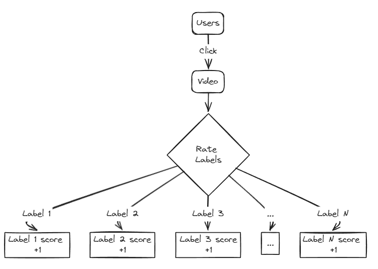
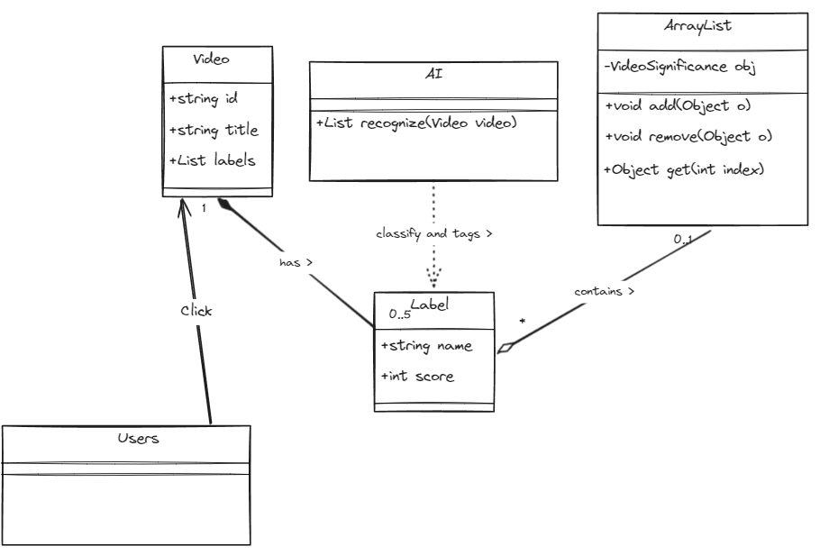
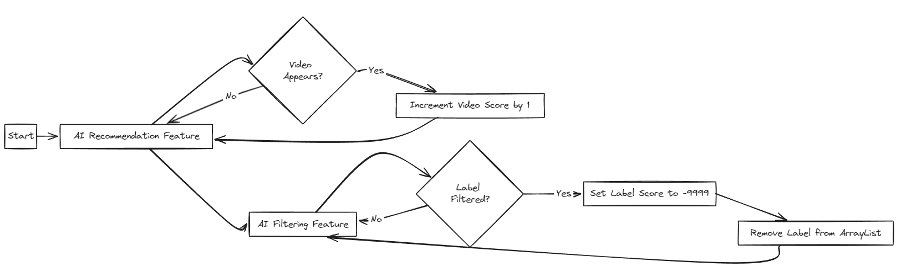
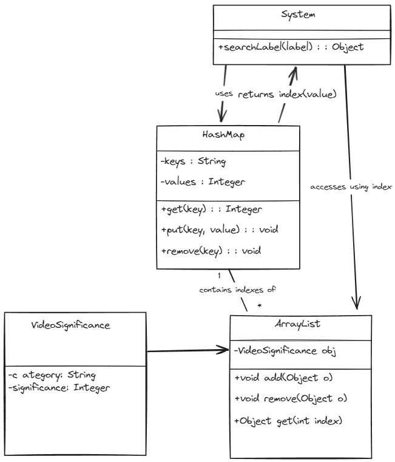

# IntelliQue Engine

> IntelliQue Engine is the core of this web application, and it is responsible for the content delivery functionality

[TOC]


## YouTube Module

### Data Structures

1. `List<UserRecord>`: This list stores the significance of each genre to the user in sorted order

2. `List<ChannelRecord>`: This list stores the significance of each channel to the user in sorted order

3. ```java
   public class UserRecord{
       private Genre genre;
       private Integer significance;
   }
   ```

4. ```java
   public class ChannelRecord{
       private String channelId;
       private Integer significance
   }
   ```

5. ```java
   public enum Genre{
       // Many more types
       FICTION,
       SPORTS,
       HEALTH
   }
   ```

## Workflow

1. When a user views a video, the description of the video will be sent to AI API for extraction of genres
2.  The extracted genres are compared with the `genre` fields in the `List<UserRecord>`, if there are matches, the `significance` field of that `UserRecord` object will increase, and the list will be reordered based on the new significance level.
3. Similarly, the channel of the viewed video increases the the significance of that `ChannelRecord` object in the `List<ChannelRecord>`
4. When a user utilizes the AI recommendation tool, the genres hidden inside the text will be extracted via AI, and the respective significance of the `UserRecord` object will increase
5. Similarly, when a user utilizes the AI filtering tool, the significance level of the genre hidden inside will decrease


## Algorithm for Intellique-engine:

This document will explain how the algorithm for Intellique-engine works. In the description below, rating and significance mean the same, so they are interchangeable.

## Principle:

Videos being uploaded by users are expected to be recognized and tagged with a few labels of type by AI, such as anime, pets or science etc. There will be five labels to a video at maximum. Each label is expected to be evaluated and rated a score, which will determine its importance, and that is the key of determining whether the video with the label would be recommended by the system. The rated score along with its label are packed in an object that is saved in an arraylist, and there will be hundreds of labels in the arraylist, which their position of index would be dynamically shifted as videos with one or multiple of these labels being clicked. Score of each label being tagged on a video is increased by one for each click to the video. The higher the score of a tag/label, the lower the index it is in an arraylist.





There is an AIrecommandation feature, which is used to recommend videos according to AI’s analysis. Any video appears on it will hold an increment in the score of one. There is also an AIfiltering feature, which is used to filter labels. Any labels being filtered will be rated -9999, which will result in being immediately removed from the arraylist as the score is below 0. This operation could relief the usage of storage of database.



A hashmap is used to improve the efficiency of searching for labels in an arraylist. Each key has the name of a label, and the corresponding index in an arraylist for its value. These indexes will also dynamically change as the position of labels change in the arraylist. When the system needs to look for a label in the arraylist, it will look for the index of this label in the hashmap it is contained first. When it finds the index it wants, it will directly access the index position of the object that contains this label in the arraylist, and extract the information inside. If a score increment operation has been done, then the system will shift the index position of the current object toward lower index position, until it meets the object that has higher scores.



## Complexity:

It is expected that using arraylist will have complexity of O(n). Whereas complexity will be O(1) if we use the combination of arraylist and hashmap due to that the program could directly access to the index of arraylist via retrieving index values from hashmap. In our purpose, the worst case will be the complexity of O(n), while the best case will be O(1). The average case will be O(k) for which k stands for as many times of operation as needed to complete a shift of a label in an arraylist and hashmap.

The reason that linked list is not considered an option is that the best case of its complexity is O(n) due to its data structure. Also, quick sort method is not used either, because its advantage is to sort unsorted array instead of a partially sorted array.

## Conclusion:

In conclusion, the purpose of our algorithm design is to utilize memory to exchange for a better response time.


