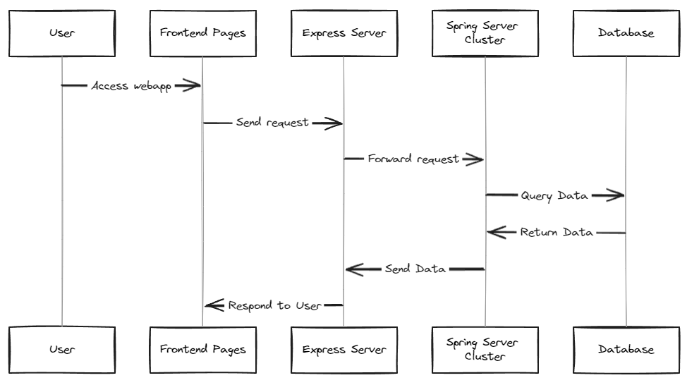
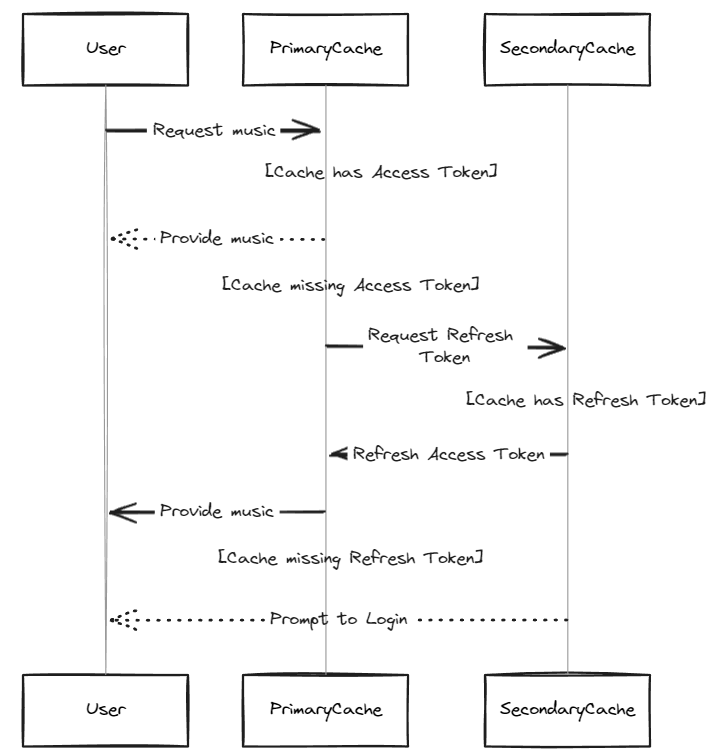

# An Overview Of This Web App

## Structure
- This webapp consists of frontend pages, express server, spring server cluster and database. When user access to a webapp page, requests will be sent out to express server. These request will be proceeded by the express server, and forwarded to database which keeps all the data obtained from external through the node servers. For the Node servers in backend, there are different ways to manage data flows.

## AIServiceNode
- AIRecommandation and AIFilter are two functions that are connected to chatgpt. To successfully access to these functions, keys words are necessary to feed chatgpt in order to get expected results. Therefore, these two functions take description in text as the key words in frontend pages. Also, the use of chatgpt’s API is deigned and coded in an individual module, which makes the entire function independent and modular.
## IntelliCueEngineNode
- This node has been introduced in another documentation file.
## MailServiceNode
- This node server is designed to manage notification and mails. It has a single cache layer, which is used to contain and manage services like mail context and authentic codes etc. 
## MongoDBServiceNode
- We use MongoDB as the database for this webapp. It is where all data and service such as the video data and music data retrieved from API and information of users, stored and organized. Data that can be found in cache will not be searched again in database. User passwords within the database are encrypted. Aside, Spotify data has a single layer cache within MongoDB. Every update to the data of spotify portion within MongoDB will be synchronized to its single layer cache as well. Transaction support is used to reinforce ACID properties.
## MySQLDatabaseServiceNode
- MySQL database was initially considered to be a database for this webapp. However, although MySQL database is a relational database where we can store data in a well-organized structure, it is difficult to be set up. Therefore, MongoDB works better in this case, so MySQL database had been removed from this project.
## YouTubeServiceNode
- Youtube videos are mainly dependent on recommendation. The data of recommended videos is provided from three external sources, original Youtube API, AI recommendation and IntelliCue-Engine.
## SpotifyServiceNode
- Unlike Youtube videos, Spotify music only comes from the original spotify API. It uses double layer caching to manage access to its functions. The primary cache layer has OAuth2.0 access token, which user will always access first. If there is not a matched access token, then the primary cache layer will be penetrated, and the secondary cache layer will be accessed to fetch a refresh token, and this refresh token will refresh a new access token and save it to the primary cache layer. If it still failed to fetch a refresh token, then user needs to login. 

- It is mentionable that there are two types of access token respectively used for accessing music play service and music search service. To access music search service, a client ID with a corresponding access token will be needed. All types of access token will only last a short period, and will need to be obtained again after being expired.

## Test
- There are three tests for explore, spotify and Youtube page. For every page, it consists of multiple components, tests are set up to mainly test the rendering of these components to check whether they are properly rendered. The testing library used in this case here is Vitest, a library designed for react testing. Additionally, further improvement will be leveraging Jest for backend testing purposes.